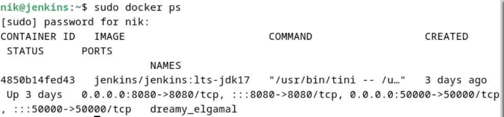
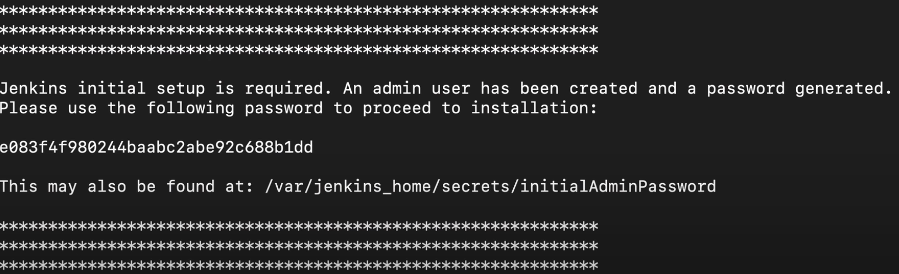
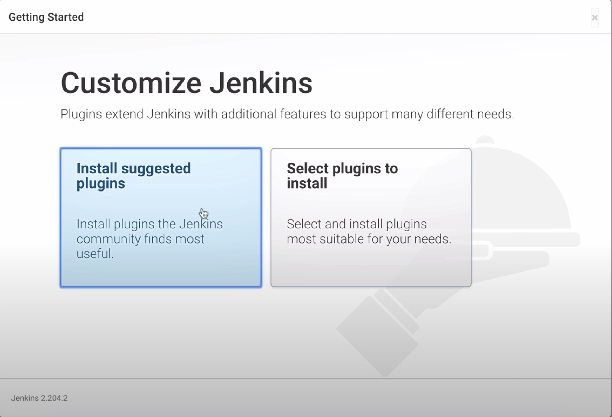
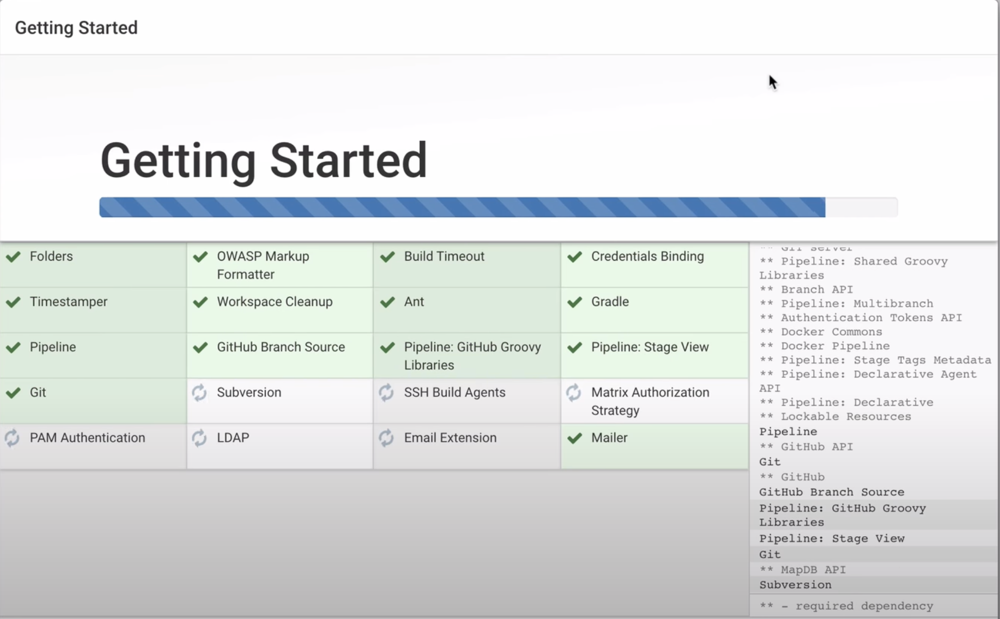

# Configuring Jenkins with a Discord Bot

This guide demonstrates how I integrated Jenkins with my Discord bot for CI/CD tasks.

## Prerequisites

- Any Linux OS.
- Docker installed.

---

## 1. Create a Docker Container With Jenkins

This is done by inputting the command

```bash
sudo docker run -p 8080:8080 -p 50000:50000 -d -v jenkins_home:/var/jenkins_home jenkins/jenkins:lts
```

### Explanation

- Runs on port 8080 as its the default web server port.
- Exposes port 50000 for master/slave communication.
- `-d` runs in detached mode allowing the container to run in the background.
- `-v jenkins_home:/var/jenkins_home` binds the volume jenkins_home to the system directory `/var/jenkins_home`.

## 2. Verify the container is Running and Retrieve Temporary Admin Password

Input to retrieve active docker containers:

```bash
sudo docker ps
```



<div align="center">
  <p>Output of previous command</p>
</div>

Now input this and scroll up to retrieve the first sign in password:

```bash
sudo docker logs <CONTAINER ID>
```



<div align="center">
  <p>Scroll up to see something like this. Copy and Paste the password string</p>
</div>

## 3. Final Jenkins Installation

### Install all suggested packages



### Wait and ensure all packages are installed



Afterwards, Jenkins can be accessed at `localhost:8080` (on local machine) or `<IP SUBNET>:8080` if the container is running on a VM.
