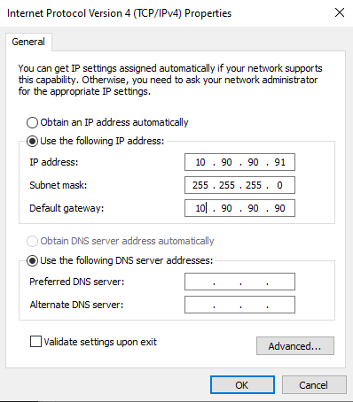
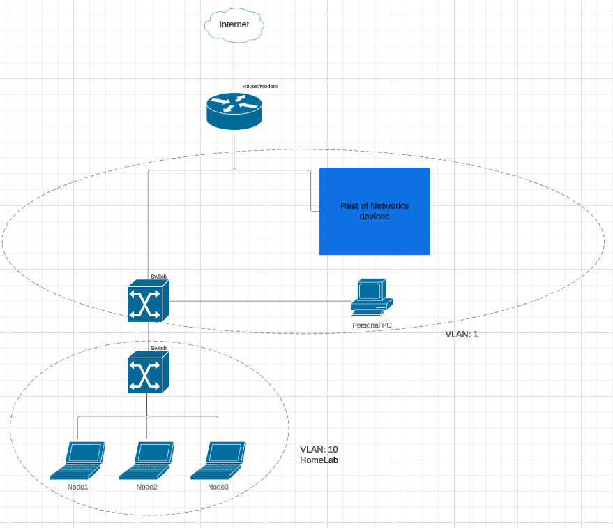

# Step-by-Step VLAN Configuration Using Web UI

This guide provides a detailed walkthrough of what I did to cofigure VLANs using the web interface of managed switches. Additionally, it explains how to temporarily adjust the computer's subnet to match the IP range of older switches for configuration purposes.

## Why I integrated VLANs?
- **Improved Security:** By isolating sensitive devices or traffic on separate VLANs, I minimise the risk of unauthorised access and reduce the impact of potential attacks.

- **Simplified Management:** VLANs allowed me to group devices both logically and physically, making it easier to manage devices across different locations.

- **Scalability and Flexibility:** VLANs enable me to seamlessly scale in the future without significant hardware changes.

## Step 1: Accessing the Switch Web Interface

1. **Determine the Switch IP Address**:
   - Check the documentation or label on the switch for the default IP address (in my case `10.90.90.90`).

2. **Adjust Computer's Subnet**:
   - Temporarily configure computer IP address to match the subnet of the switch.
     - Since the switch was on `10.90.90.90/24`, I set my laptop to `10.90.90.x` and subnet mask to `255.255.255.0`.
   - see attached image for how its done on windows OS.

3. **Access the Web Interface**:
   - Open a web browser and enter the switch's IP address (e.g., `http://10.90.90.90`).
   - Log in with the default credentials (usually found in the switch's manual) or the previously set credentials.

---

## Changing the Switch IP Address
Before starting with VLAN configuration, it’s important to ensure that the switch’s IP address was within my network’s subnet. Therefore the internal IP was changed from `10.90.90.90` to `192.168.1.x`. The device accessing the web UI had their IP changed back accordingly.

---

## Step 2: Creating VLANs

1. Navigate to the **Network Settings** section in the web interface.
2. Select the option to **Add VLAN**.
3. Enter the VLAN ID and a descriptive name for each VLAN.
   - In my HomeLab:
     - VLAN ID: `1`, Name: `House`
     - VLAN ID: `10`, Name: `HomeLab`
4. Save the configuration.

---

## Step 3: Assigning Ports to VLANs

1. Go to the **Port Settings** section.
2. Assign specific ports to their respective VLANs:
   - Select a port and configure it as an **Access Port**.
   - Choose the VLAN ID to associate with the port.
3. In my HomeLab:
    - port 8: VLAN ID: `10`
    - port 2-7: VLAN ID: `1`
4. Save the changes.

---

## Step 4: Configuring Trunk Ports

1. Identify the ports that will act as **trunk ports** (e.g., for connections to other switches or a router).
2. Configure these ports in the **Port Settings** section:
   - Set the mode to **Trunk**.
   - Specify the VLANs allowed on the trunk. 
     - port 1: trunk port
     - Allow VLANs `1`, `10`.
3. Save the configuration.

---

## Conclusion
Configuring VLANs using a switch's web interface has been a straightforward process for me, allowing me to segment and manage my network effectively. Through this experience, I’ve learned how to properly set up VLANs and test their configurations to ensure optimal performance and security. This hands on approach has helped me better understand how VLANs work and how they can enhance network management.

## Network Tapology

