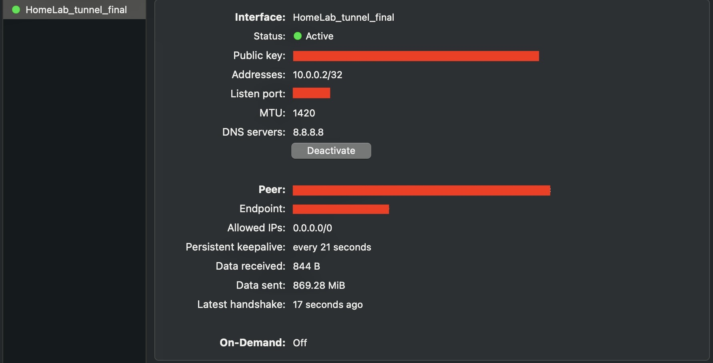

# Guide: Configuring WireGuard VPN

## Overview

This guide provides steps to configure a WireGuard VPN on a Proxmox container and client device.

---

## Part 1: Setting Up a WireGuard Container on Proxmox

### 1. **Create a WireGuard Container Using [tteck's](https://github.com/tteck/Proxmox/raw/main/ct/wireguard.sh) Script**

- Use the following command in the Proxmox shell to create a Linux Container (LXC) with WireGuard pre-installed:
  ```bash
  bash -c "$(wget -qLO - https://github.com/tteck/Proxmox/raw/main/ct/wireguard.sh)"
  ```
- Follow the prompts to:
  - Set the container name and ID.
  - Configure resources like CPU, memory, and storage.
  - Specify the network settings.

### 2. **Access the Container**

- After the container is created, log in to it given the:
  ```bash
  <address>:<port>
  ```

---

## Part 2: Configuring WireGuard on the Server

Fortunately with the script, private/public keys are automatically generated in the web UI. However, if they are required to be manually generated, they can be done by:

```bash
wg genkey > PK_file
```

```bash
wg pubkey < PrivateKey_file > PublicKey_file
```

NOTE: do `umask 077` before generating the files in order to restrict them from being viewed by unauthorised users.

### 1. **Set Up the WireGuard Configuration File**

- Create the configuration file:
  ```bash
  nano /etc/wireguard/wg0.conf
  ```
- Example configuration:

  ```ini
  [Interface]
  PrivateKey = <server_private_key>
  Address = 10.0.0.2/32
  MTU = 1420
  DNS = 1.1.1.1

  [Peer]
  PublicKey = <client_public_key>
  AllowedIPs = 0.0.0.0/0
  Endpoint = <publicIP>:<port>
  PersistentKeepalive = 21
  ```

### Explanation:

<ins>Interface</ins> Section:

- `PrivateKey = <server_private_key>`: This is the server's private key, used to decrypt incoming traffic and sign outgoing traffic.

- `Address = 10.0.0.2/32`: This assigns the IP address 10.0.0.2 to the server's WireGuard interface, with a subnet mask of /32, indicating theres the only subnet 10.0.0.2. This address is used for communication within the VPN.

- `MTU`: Maximum Transmission Unit refers to the largest packet size that can be transmitted over a network without fragmentation. It ensures efficient data transfer by reducing overhead but must be optimised to avoid issues like dropped packets.

- `DNS`: Domain Name System acts as the internet's address book, translating human readable domain names e.g. google.com, into IP addresses that computers use to communicate. `1.1.1.1` is the public cloud flare `DNS`.

<ins>Peer</ins> Section:

- `PublicKey = <client_public_key>`: This is the public key of a client that is authorised to connect to the server. The server uses this key to authenticate the client and encrypt traffic destined for it.

- `AllowedIPs = 0.0.0.0/0`: Defines the IP addresses that the server will route to this peer. In this case, 0.0.0.0/0 represents all possible `IPV4` IPs (4,294,967,296 combinations), which is assigned to the client within the VPN. This setting also determines which IP addresses the server will accept from the client.

- NOTE: Replace `<server_private_key>` and `<client_public_key>` with the actual keys.

Since I used my home network, the Peer endpoint address is the public IP given to me by my ISP and the port that is forwarded within my router.

### 1.5 **Set Up the WireGuard Configuration File Through Web UI**

### 2. **Start WireGuard**

- Bring up the WireGuard interface:

  ```bash
  wg-quick up wg0
  ```

  or turn on the slider within the web UI:

  <div style="width: 325px; height: 175px; overflow: hidden;">
    
  </div>

- Enable the interface to start on boot:
  ```bash
  systemctl enable wg-quick@wg0
  ```

### 3. **Configure Port Forwarding**

- On your router, forward the WireGuard port used int the config gile in step 3 to the server's local IP address.

### 4. **Configure WireGuard on Client Side**

- Download the WireGuard app and import the config file.

  <div align="center">
  
  </div>

---

### 5. **Check WireGuard Status**

- On the server console:

  ```bash
  wg
  ```

  or access the web UI

  <div align="center">
    
  </div>

- Ensure the client appears as a peer and traffic is being transmitted.

### 6. **Test Connectivity**

- On the client, test internet access and connectivity to the VPN server.
- Check if DNS resolution works:

  ```bash
  ping 1.1.1.1
  ```

  ```bash
  nslookup google.com
  ```

---
