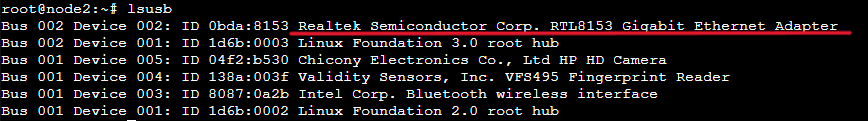
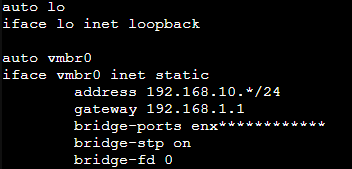
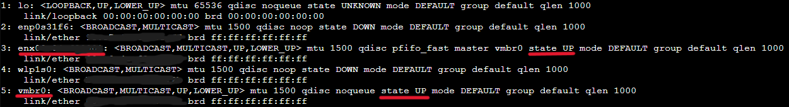

# Configuring `vmbr0` in Proxmox with a Network Adapter

This is a step by step on how I configured and troubleshooted the `vmbr0` bridge in Proxmox to work with my USB - Eth network adapter, enabling proper connectivity and access to the web interface.

## Key Concepts
- **Bridge (`vmbr0`)**: A virtual network switch that connects virtual machines, containers, and the physical network interface.
- **Static IP Address**: A fixed IP for `vmbr0`, ensuring stable connectivity to the Proxmox Web UI.
- **Gateway**: The IP address of my router, used for external network communication.
- **DNS Server**: Resolves domain names.
- **bridge-port**: Interface used for the bridge.
- **bridge-step**: Shortest spanning tree algorithm to remove any potential loops.
- **bridge-fd**: Forward delay for interfaces joining the bridge.

## 1. Verify the physical adapter
1. Run the command to list all the USB devices
   ```shell
   lsusb
   ``` 
   You should see the adapter connected to a USB port

   

2. Run the following command to list all network interfaces:
   ```shell
   ip link
   ```
   here vmbr0 will most likely be status: DOWN as the computer is not utilising the adapter. Furthermore, there will most likely be a `enx**********` which is the Ethernet External Device (USB adapter) 

## 2. Check `vmbr0` Interface Configuration

Modify `/etc/network/interfaces` to this:



`auto vmbr0` means that `vmbr0` has its status: UP automatically whenever the system is booted up.

`iface vmbr0 inet static` means that the address is not modified by the network's `DHCP` 

`bridge-ports` is the interface used by the adapter to bridge the ethernet (which is found in the previous step using `ip link`)

`bridge-stp` This is enabled since my homelab setup consists of two switches and I want to eliminate potential loops at the cost of efficiency.

## 3. Check `vmbr0` Configuration

To restart the config to enable changes, type:
```shell
systemctl restart networking
``` 
To verify changes, once again:
```shell
ip link
```




## Troubleshooting

While figuring this out, I came across problems that made this process difficult. Here are some trouble shooting steps.

1. if you cannot find the device when using `lsusb`, either the port is faulty or the device is not working.
2. if you cannot find the `enx` interface code for the adapter after typing `ip link`, the adapter is most likely incompatible with **Proxmox** or the kernel driver for the adapter isn't initialised. This can be checked with:
```shell
dmesg | grep -i usb
```
or
```shell
dmesg | grep -i eth
```
dmesg is checking for error logs. this is pipelined into grep which searches for "usb" or "eth" (ethernet) logs.

3. The laptop I was using has really loose and faulty USB ports, as a result the adapter would disconnect and the `vmbr0` interface state would go *DOWN*. To resolve this, reconnect the adapter and type to set state to *UP*:
```shell
ip link set vmbr0 UP
```
then restart the network with:
```shell
systemctl restart networking
```


