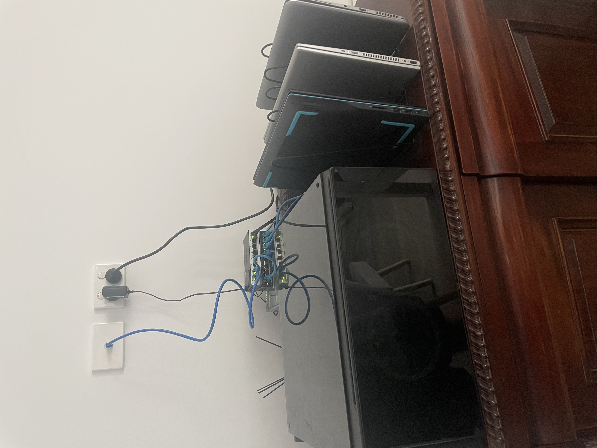

<h1 align="center"> Nik's HomeLab </h1>

## Project Overview

### 🚀 Project Status: **IN DEVELOPMENT**

This project is a personal exploration aimed at deepening my understanding of networking, servers and related technologies. It’s a hands on learning experience to help me grow my skills and gain practical knowledge by experimenting with different concepts and tools. While it is still in the early stages, my goal is to learn by creating and implementing projects within the [HomeLab](https://en.wikipedia.org/wiki/Home_server).

---

### 🖥️ Hardware Overview

#### Servers

- **1 × Dell G3 15 3590 laptop**

  - **CPU:** Intel(R) Core(TM) i5-9300H CPU @ 2.40GHz
  - **RAM:** 8GB
  - **SSD:** 512GB

- **1 × HP EliteBook Folio 1040 G3 laptop**

  - **CPU:** Intel(R) Core(TM) i5-6200U CPU @ 2.30GHz
  - **RAM:** 8GB
  - **SSD:** 256GB

- **1 × HP Pavilion x360 Convertible laptop**
  - **CPU:** Intel(R) Core(TM) i5-8250U CPU @ 1.60GHz
  - **RAM:** 8GB
  - **SSD:** 256GB

#### Networking

- **D-Link DGS-1100-08 switch**

  - **Ports:** 8
  - **Speed:** 1000Mbps

- **D-Link DGS-1100-08V2 switch**

  - **Ports:** 8
  - **Speed:** 1000Mbps

- **2x Type-C3.1/USB 1000Mbps Ethernet Adapters**

---

### ✨ Features

The system includes the following features:

- **Minecraft server:** The system hosts a Minecraft server within a Docker container running on a Debian-12 virtual machine.
- **VPN server:** The system uses a WireGuard VPN server running in a Proxmox container to provide secure, fast, and encrypted VPN access.
- **Python Backup Script:** The system hosts a CRON job with a python script that backups up data periodically.
- **VM Reboot Script:** Node hosts a CRON job with a bash script that reboots specified VMs periodically.
- **Discord Bot: (IN DEVELOPMENT)** Multipurpose discord bot for my personal discord server with CI/CD configuration.

---

### ⚙️ Tech Stack

| Logo                                                                    | Name      | Description                                                                                                                                                                |
| ----------------------------------------------------------------------- | --------- | -------------------------------------------------------------------------------------------------------------------------------------------------------------------------- |
|      | Proxmox   | Virtualisation platform I use to host Debian-12 VMs and LXCs                                                                                                               |
|        | Docker    | Containerisation platform I use for creating and running apps such as a minecraft server and Jenkins.                                                                      |
|  | WireGuard | Encrypted VPN software I use to remotely access my homelab.                                                                                                                |
|        | Python    | A high level programming language I mostly use for scripting such as file manipulation/permissions. I am also currently developing a discord bot written in this language. |
|      | Jenkins   | Jenkins is an automation server that helps automate tasks like building, testing, and deploying software. I currently use it as a CI/CD pipeline for my discord bot.       |

---

### 🛠️ Tools

| Logo                                                            | Name  | Description                                                                                                                              |
| --------------------------------------------------------------- | ----- | ---------------------------------------------------------------------------------------------------------------------------------------- |
|  | Rufus | A utility to create bootable USBs for installing OS or system recovey. Mainly used to install Proxmox and TrueNAS Scale                  |
|        | Cron  | A time based job scheduler for automating tasks in Unix operating systems. Mainly used to run python/bash scripts at specified intervals |

---

## 🎓 Personal Guides

- [VLAN Configuration](./Documents/Guides/VLAN_Config.md) - Guide on how I configured VLANs in my home network using a managed switch.

- [Configuring WireGuard VPN](./Documents/Guides/Wireguard_Config.md) - Guide on how I created a WireGuard VPN server to be able to connect to my personal network remotely.

- [Installing Jenkins](./Documents/Guides/Jenkins_Setup.md) - Guide on how I installed Jenkins within Debian VM, Docker container with permanent up time.

## 📈 HomeLab Development

- [Adapter Configuration](./Documents/HomeLab/Eth-USB_Config.md) - How I configured a NIC bridge to a USB port in order to allow a device without an ethernet port to connect to the internet.

- [Disable Laptop Sleep](./Documents/HomeLab/Laptop_Sleep.md) - How I managed to disable the laptop sleep config on lid shutting in a linux based system.

- [Configuring Proxmox Cluster](./Documents/HomeLab/ConfiguringCluster.md) - Guide on how to create a server cluster within Proxmox.

- [NFS/NAS](./Documents/HomeLab/NAS.md) - The process I took to refurbish an old computer and convert it into a fully functional NAS with 2.5TB storage.

## 💻 Scripting

- [Docker data backup](./Documents/Scripting/Backup_Script.md) - An overview on how I utilised Docker, Cron and a personalised python script to back up docker data.

- [Automatic VM reboot](./Documents/Scripting/Reboot.md) - How I automated the process of rebooting virtual machines - keeping extensibility in mind.

- [CI/CD Jenkins pipeline](./Documents/Scripting/Jenkins.md) - How I automated testing and deployment of my discord bot with permanent uptime.

---

## 🚀 Future developments

- Ansible
- Malware zoo
- local DNS server
- NFS/NAS (IN PROGRESS)

## Pictures

  
  
My HomeLab setup after creating a 3 node cluster. <i><b>DEC/2024</b></i>

  
  
NAS in Development. <i><b>JAN/2025</b></i> 

