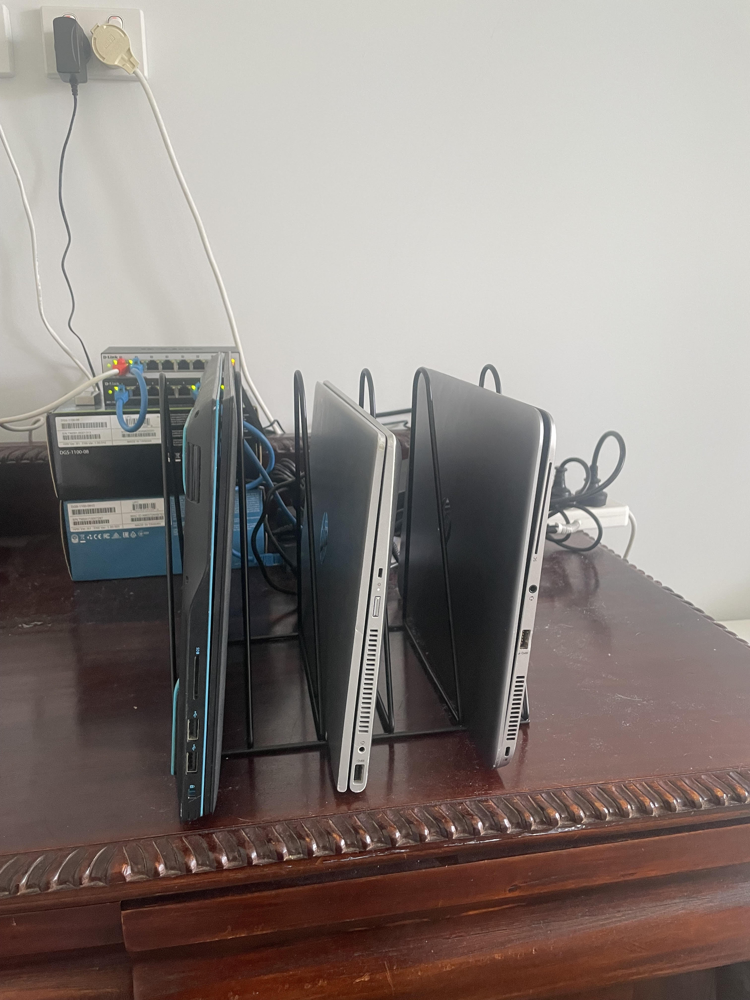

# Nik's HomeLab

## Project Overview

### 🚀 Project Status: **IN DEVELOPMENT**

This project is a personal exploration aimed at deepening my understanding of networking, servers and related technologies. It’s a hands on learning experience to help me grow my skills and gain practical knowledge by experimenting with different concepts and tools. While it is still in the early stages, my goal is to learn by creating and implementing projects within the **HomeLab**.

---

### 🖥️ Hardware Overview

#### Servers
- **1 × Dell G3 15 3590 laptop**  
  - **CPU:** Intel(R) Core(TM) i5-9300H CPU @ 2.40GHz  
  - **RAM:** 8GB  
  - **SSD:** 512GB  

- **1 × HP EliteBook Folio 1040 G3 laptop**  
  - **CPU:** Intel(R) Core(TM) i5-6200U CPU @ 2.30GHz  
  - **RAM:** 8GB  
  - **SSD:** 256GB 

- **1 × HP Pavilion x360 Convertible laptop**  
  - **CPU:** Intel(R) Core(TM) i5-8250U CPU @ 1.60GHz
  - **RAM:** 8GB  
  - **SSD:** 256GB

#### Networking
- **D-Link DGS-1100-08 switch**  
  - **Ports:** 8  
  - **Speed:** 1000Mbps

- **D-Link DGS-1100-08V2 switch**  
  - **Ports:** 8  
  - **Speed:** 1000Mbps  

- **2x Type-C3.1/USB 1000Mbps Ethernet Adapters**

---

### ✨ Features

The system includes the following features:
- **Minecraft server:** The system hosts a Minecraft server within a Docker container running on a Debian-12 virtual machine.
- **VPN server:** The system uses a WireGuard VPN server running in a Proxmox container to provide secure, fast, and encrypted VPN access.

---

### ⚙️ Tech Stack  

| Logo                                                                                 | Name      | Description                      |
|--------------------------------------------------------------------------------------|------------|----------------------------------|
|                   | Proxmox   | Open-source virtualiation platform. |
|                    | Docker    | Containerisation platform for creating and running apps. |
|               | WireGuard | Fast, modern VPN technology with strong encryption. |

---

### 🛠️ Tools

| Logo                                      | Name   | Description                     |
|-------------------------------------------|--------|---------------------------------|
|  | Rufus  | A utility to create bootable USBs for installing OS or system recovery |

## 🚀 Future developments
- Jenkins
- Malware zoo
- NFS/NAS

## Personal Guides
[VLAN Configuration](./Documents/Guides/VLAN_Config.md)

## HomeLab Development

[Adapter Configuration](./Documents/HomeLab/Eth-USB_Config.md)

[Disable Laptop Sleep](./Documents/HomeLab/Laptop_Sleep.md)

## Pictures

  

